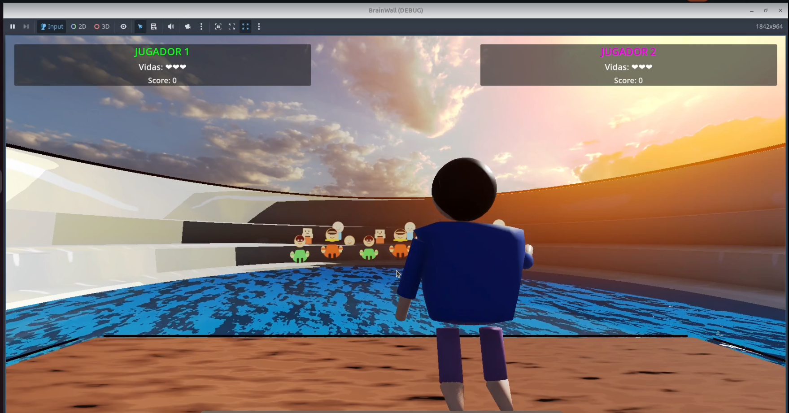
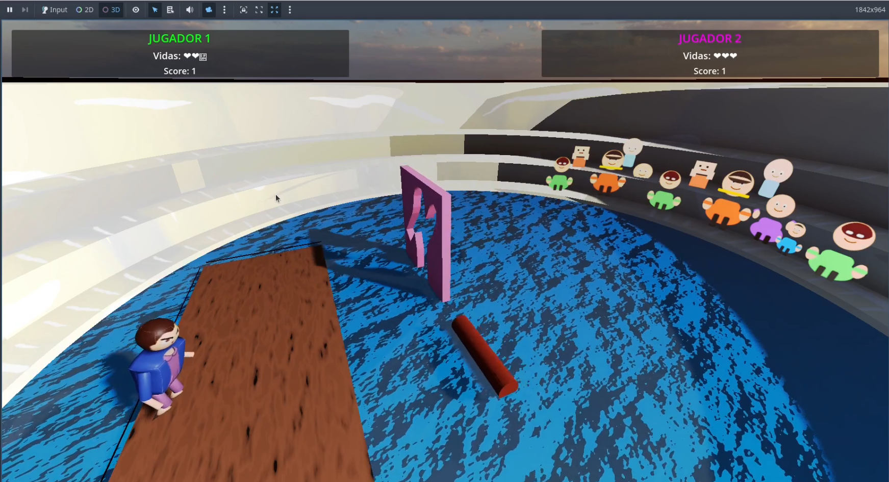

# Vision Wall 🧠

Juego 3D interactivo que detecta tu postura corporal en tiempo real usando inteligencia artificial. Tu cuerpo controla el personaje del juego mientras evitas obstáculos en un entorno dinámico.

📄 **[Ver Memoria del Proyecto](./INFORME/MEMORIA.pdf)** | **[Ver en GitHub](https://github.com)**

## 📋 Descripción del Proyecto

Vision Wall es una experiencia de videojuego inmersiva basada en visión por computadora que:
- Captura tu cuerpo en tiempo real a través de la cámara web
- Detecta 33 puntos clave de tu esqueleto corporal
- Sincroniza tus movimientos con un personaje 3D en el juego
- Genera obstáculos dinámicos que debes esquivar
- Incluye selección de personajes (Homero Simpson, ET, Coliseum, etc.)
- Sistema de puntuación y progresión de dificultad

### Capturas del Juego


*Pantalla de juego en acción*




## 🛠️ Tecnologías Utilizadas

| Componente | Tecnología | Función |
|-----------|-----------|---------|
| **Captura de Video** | OpenCV | Acceso a cámara web en tiempo real |
| **Detección de Poses** | MediaPipe Holistic | Identificación de 33 landmarks del cuerpo |
| **Servidor de Poses** | Python + WebSockets | Transmisión de datos de poses en tiempo real |
| **Motor de Juego** | Godot Engine 4.5 | Renderizado 3D y lógica del juego |
| **Modelado 3D** | Blender | Creación de personajes y escenarios |
| **Audio** | LMMS | Música y efectos de sonido |

## 📥 Instalación Detallada

### Paso 1: Crear Entorno Python

```bash
# Crear ambiente conda con Python 3.11
conda create --name VC_FINAL python=3.11.14

# Activar el ambiente
conda activate VC_FINAL

# Instalar dependencias necesarias
pip install websockets mediapipe opencv-python numpy
```

### Paso 2: Descargar Modelo de MediaPipe

El archivo `pose_landmarker_full.task` ya está incluido en el directorio raíz. Contiene el modelo entrenado para detectar poses humanas.

### Paso 3: Configurar Godot

1. Descarga e instala **Godot Engine 4.5** desde [godotengine.org](https://godotengine.org)
2. Abre Godot
3. Selecciona "Importar" y navega a: `BrainWallGodot/brain-wall/project.godot`
4. Espera a que Godot importe y cargue el proyecto (puede tomar 1-2 minutos)

## 🚀 Ejecución del Juego

### Paso 1: Inicia el Servidor Python
```bash
# Asegúrate de estar en la carpeta raíz del proyecto
cd C:\Users\Desktop\UNI\VC\Entrega_FINAL_VC

# Activa el ambiente
conda activate VC_FINAL

# Ejecuta el servidor de detección de poses
python mediapipe_util.py```

**Esperado**: Deberías ver un mensaje indicando que el servidor está escuchando conexiones (por defecto en puerto 8765).

### Paso 2: Inicia el Juego en Godot

1. En Godot, asegúrate de que el proyecto está abierto
2. Selecciona la escena principal en el árbol de escenas
3. Presiona el botón **Play** (▶️) o pulsa **F5**
4. El juego se abrirá en una ventana nueva

### Paso 3: Juega

1. Se abrirá una pantalla de selección de personajes
2. Elige tu personaje favorito
3. El juego conectará automáticamente con el servidor Python
4. ¡Empieza a moverte! Tu cuerpo controlará al personaje

## 🎮 Controles en Juego

- **Movimiento**: Tu cuerpo controla al personaje automáticamente
  - Mueve el torso izquierda/derecha para desplazarte
  - Levanta los brazos para saltar
  - Agáchate para esquivar
  - C para calibrar


````
## 👥 Equipo de Desarrollo

**Trabajo Final** - Visión por Computador
Universidad de Las Palmas de Gran Canaria

### Autores
- **Nicolás Rey Alonso**
- **Wafa Azdad Triki**
